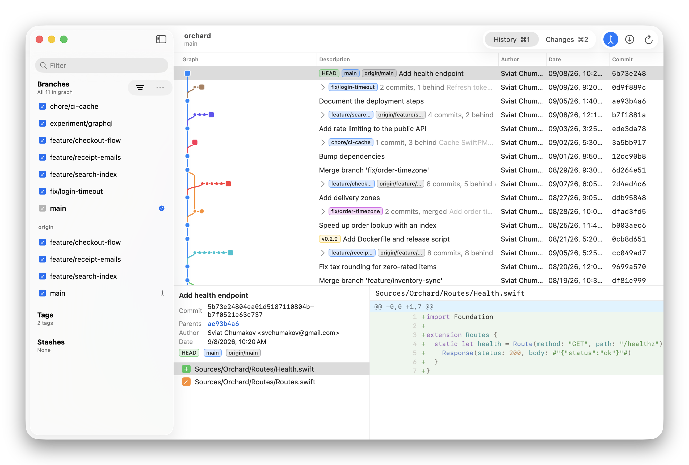

  <picture>
    <source media="(prefers-color-scheme: dark)" srcset="Docs/hero-dark.png">
    
  </picture>

# Lanes

A native macOS git client with a graph you can read. In trunk view the trunk is the only lane;
every other branch sits beside the commit it forked from, its commits drawn as a chain growing
sideways, so a repository with fifty branches still fits on one screen. Expand a branch to see its
commits inline, or switch to the classic graph and pick which branches it draws, a choice remembered
per repository.

Staging works hunk by hunk or line by line, with tree-sitter syntax highlighting in the diffs.
Branches, tags and stashes live in the sidebar with right-click menus for the everyday actions;
merging and rebasing stay in the terminal. Git runs through the `git` executable, so hooks, filters
and worktrees behave exactly as on the command line. Builds are signed, notarized and update
themselves.

[Download the latest release](https://github.com/Lermex/Lanes/releases/latest) · requires macOS 26

[Installing](Docs/Installing.md) · [Behaviour](Docs/Behaviour.md) · [Building](Docs/Building.md) ·
[Releasing](Docs/Releasing.md) · [Debugging](Docs/Debugging.md) · [App icon](Docs/AppIcon.md)
